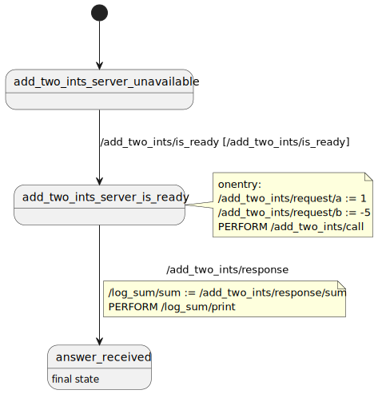

# Tutorial

In this tutorial we will rebuild the [Service Client Demo](../README.md#service-client-demo) from scratch.

## Setup Workspace

At first we need a `catkin` workspace (as described
[here](https://docs.ros.org/en/rolling/Tutorials/Beginner-Client-Libraries/Creating-A-Workspace/Creating-A-Workspace.html)).
After that we need to clone few repositories into that workspace:

 - the monkey brain repository: `git clone https://github.com/cwecht/monkey_brain.git`
 - the package containing the service definition we need to interact with: `git clone https://github.com/ros2/example_interfaces.git`
 - two ROS2 packages which we need for technical reasons: 
   - `git clone https://github.com/ros2/rosidl_core.git` and
   - `git clone https://github.com/ros2/rosidl_defaults.git`

`rosidl_core` and `rosidl_defaults` are needed because of the way the automatic plugin generation works.
`rosidl_generator_monkey_brain` is a rosidl generator which can generate Monkey-Brain-IO-Plugins for
ROS2 messages, services and actions.
In order for catkin to recognize this new generator -- and execute it during the build -- `rosidl_core`
and `rosidl_defaults` need to be place in the same workspace.

Now we just build this workspace as usual by executing:

```
colcon build
```

## Create plugins.yaml

Now we need to define, how our state machine is supposed to interact with the out world.
In general monkey brain uses *io plugins* for that.
`plugins.yaml` defines which plugins shall be loaded, how they are accessible from
the state machine and how they are configured.

The basic structure of each `plugins.yaml` looks like this:

```YAML
io: []
operators: []
```

We don't need to care about the `operators` field for now.
For us now only the `io` field is important.
For each io plugin we will need to add a new entry here.

For the service client demo we need *two* plugins:
 - the "service plugin" in order to call the `AddTwoInts` service and
 - the "logger plugin".

Monkey brain has a well defined naming schema for io plugins, so we actually could
just know the names of each plugin.
But in practice it's usually more helpful to know which plugins are available in
the current workspace.
For tasks like this a utility tool called `monkey_tool` exists.
In order to see which io plugins are available, just execute `monkey_tool list_io_plugins`.
This should give you an output like this:

```
65 available IOPlugins:
 - basic_logger/Logger
 - example_interfaces/AddTwoInts/ServiceClient
 - example_interfaces/Bool/Publisher
 - example_interfaces/Bool/Subscriber
 - example_interfaces/Byte/Publisher
 - example_interfaces/Byte/Subscriber
 - example_interfaces/ByteMultiArray/Publisher
 - example_interfaces/ByteMultiArray/Subscriber
 - example_interfaces/Char/Publisher
 - example_interfaces/Char/Subscriber
 - example_interfaces/Empty/Publisher
 - example_interfaces/Empty/Subscriber
 - example_interfaces/Fibonacci/ActionClient
 - example_interfaces/Float32/Publisher
 - example_interfaces/Float32/Subscriber
 - example_interfaces/Float32MultiArray/Publisher
 - example_interfaces/Float32MultiArray/Subscriber
 - example_interfaces/Float64/Publisher
 - example_interfaces/Float64/Subscriber
 - example_interfaces/Float64MultiArray/Publisher
 - example_interfaces/Float64MultiArray/Subscriber
 - example_interfaces/Int16/Publisher
 - example_interfaces/Int16/Subscriber
 - example_interfaces/Int16MultiArray/Publisher
 - example_interfaces/Int16MultiArray/Subscriber
 - example_interfaces/Int32/Publisher
 - example_interfaces/Int32/Subscriber
 - example_interfaces/Int32MultiArray/Publisher
 - example_interfaces/Int32MultiArray/Subscriber
 - example_interfaces/Int64/Publisher
 - example_interfaces/Int64/Subscriber
 - example_interfaces/Int64MultiArray/Publisher
 - example_interfaces/Int64MultiArray/Subscriber
 - example_interfaces/Int8/Publisher
 - example_interfaces/Int8/Subscriber
 - example_interfaces/Int8MultiArray/Publisher
 - example_interfaces/Int8MultiArray/Subscriber
 - example_interfaces/MultiArrayDimension/Publisher
 - example_interfaces/MultiArrayDimension/Subscriber
 - example_interfaces/MultiArrayLayout/Publisher
 - example_interfaces/MultiArrayLayout/Subscriber
 - example_interfaces/SetBool/ServiceClient
 - example_interfaces/String/Publisher
 - example_interfaces/String/Subscriber
 - example_interfaces/Trigger/ServiceClient
 - example_interfaces/UInt16/Publisher
 - example_interfaces/UInt16/Subscriber
 - example_interfaces/UInt16MultiArray/Publisher
 - example_interfaces/UInt16MultiArray/Subscriber
 - example_interfaces/UInt32/Publisher
 - example_interfaces/UInt32/Subscriber
 - example_interfaces/UInt32MultiArray/Publisher
 - example_interfaces/UInt32MultiArray/Subscriber
 - example_interfaces/UInt64/Publisher
 - example_interfaces/UInt64/Subscriber
 - example_interfaces/UInt64MultiArray/Publisher
 - example_interfaces/UInt64MultiArray/Subscriber
 - example_interfaces/UInt8/Publisher
 - example_interfaces/UInt8/Subscriber
 - example_interfaces/UInt8MultiArray/Publisher
 - example_interfaces/UInt8MultiArray/Subscriber
 - example_interfaces/WString/Publisher
 - example_interfaces/WString/Subscriber
 - oneshot_timer/Inputter
 - timer/Inputter
```
Based on this, we can see that all plugins we need are actually available:
 - `example_interfaces/AddTwoInts/ServiceClient` for the `AddTwoInts` service and
 - `basic_logger/Logger` for writing logs.

### Configure `example_interfaces/AddTwoInts/ServiceClient`

As we need to learn how to use `basic_logger/Logger`,
we execute

```
monkey_tool show_io_plugin basic_logger/Logger
```

This should give us this:

```
Creates a service client of type example_interfaces/AddTwoInts.
It provides a variable <prefix>/is_ready which indicates whether the service is online (a matching service server is online).
As long a the service is not online, this variable is periodically updated by a timer with a period of <retry_period>
ms. As soon as the service is available the a <prefix>/is_ready event is triggered.

parameters: 1
 - retry_period: the retry period of connecting to the service server.
value references: 4
 - <prefix>/is_ready {boolean, R)
 - <prefix>/response/sum {int64, R)
 - <prefix>/request/a {int64, W)
 - <prefix>/request/b {int64, W)
perform references: 1
 - <prefix>/call
events: 2
 - <prefix>/response
 - <prefix>/is_ready
```

This tells us many useful things.
But most importantly it tells us, that this io plugin has a parameter `retry_period` which we need to define.
With that knowleadge we can add the service client plugin to our `plugins.yaml`:

```YAML
io: [
        { name: "example_interfaces/AddTwoInts/ServiceClient",
          topic: "/add_two_ints",
          params: { retry_period: 2000 }
        }
]
operators: []
```

This will cause monkey brain to create a service client for the `AddTwoInts` service and the "topic" (or service name)
`/add_two_ints`.

### Configure `example_interfaces/AddTwoInts/ServiceClient`

As we need to learn how to use `example_interfaces/AddTwoInts/ServiceClient`,
we can use the introspective capabilities of `monkey_brain` by executing

```
monkey_tool show_io_plugin example_interfaces/AddTwoInts/ServiceClient
```

This should give us this:

```
A log command, which will create an log line with <severity> based on <format> when <prefix>/print is performed.
<format> may contain "{}" which is are place holder. The parameter given via <parameters> will be inserted here.
The log will be logged in the node's logger.

Please note: only fundamental types (like int32, float64 or string) or arrays of fundamental types can be used!

parameters: 1
 - format(string): the the format string.
 - severity(int): the log severity (log level) of the created log messages.
 - params(string[]): the references to the values to be printed.
value references: 0
perform references: 1
 - <prefix>/print
events: 0
```

Based on this information we can now add the logger to our `plugins.yaml`:

```YAML
io: [
        { name: "example_interfaces/AddTwoInts/ServiceClient",
          topic: "/add_two_ints",
          params: { retry_period: 2000 }
        },
        { name: "basic_logger/Logger",
          topic: "/log_sum",
          params: { format: "Sum: {}", severity: 20, params: { "sum": "int64" }}
        }
]
operators: []
```

With that the state machine will now the able to issue log lines.
In this case `/log_sum` is not a topic but the prefix for the parameter `sum`.
We will talk more about that while configure the state machine.

## Configuring the state machine

This SCXML-script below
```XML
<?xml version="1.0" encoding="UTF-8"?>
<scxml xmlns="http://www.w3.org/2005/07/scxml" version="1.0" init="add_two_ints_server_unavailable">
    <state id="add_two_ints_server_unavailable">
        <transition event="/add_two_ints/is_ready" cond="/add_two_ints/is_ready" target="add_two_ints_server_is_ready"/>
    </state> 
    <state id="add_two_ints_server_is_ready">
        <onentry><script>
           /add_two_ints/request/a := 1
           /add_two_ints/request/b := -5
           PERFORM /add_two_ints/call
        </script></onentry>
        <transition event="/add_two_ints/response" target="answer_received">
            <script>
                /log_sum/sum := /add_two_ints/response/sum
                PERFORM /log_sum/print
            </script>
        </transition>
    </state> 
    <final id="answer_received"/>
</scxml>
```

is equivalent to this state chart:

<p align="left">
  
</p>

For details on the syntax and the supported elements of the SCXML specification, please,
refer to the [SCXML User Manual](scxml_user_manual.md).

This example state machine works basically like this.
0. During the startup of the node a service client for the service `/add_two_ints` is created.
   This will also create a time which will check for the existence of this service every 2s.
1. The state machine is initialized with the state `add_tow_ints_server_unavailable`.
   As soon as `/add_two_ints` evaluates to `true`, it will transition into `add_two_ints_server_is_ready'.
   This `/add_two_ints` is evaluated every 2s -- triggered through the timer attached to the service client.
2. As the service is now available a service all is issued (`PERFORM /add_two_ints/call`).
   This will happen each time, `add_two_ints_server_is_ready' is entered.
3. As soon as the response is received, the `/add_two_ints/response` event is issued.
   Now the state machine will transition to `answer_received`. During the transition it will log
   the result.
4. As `answer_received` is the final state of the root state machine, monkey brain will terminate.

